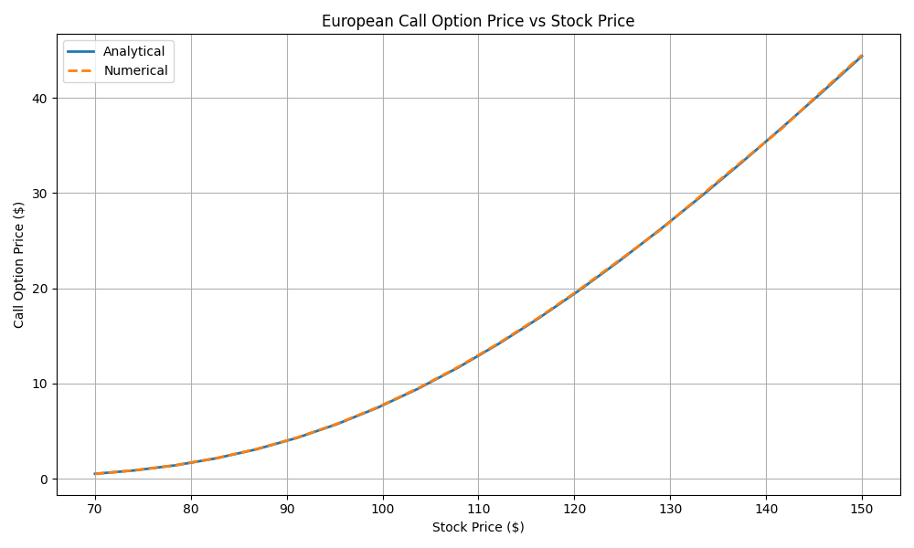
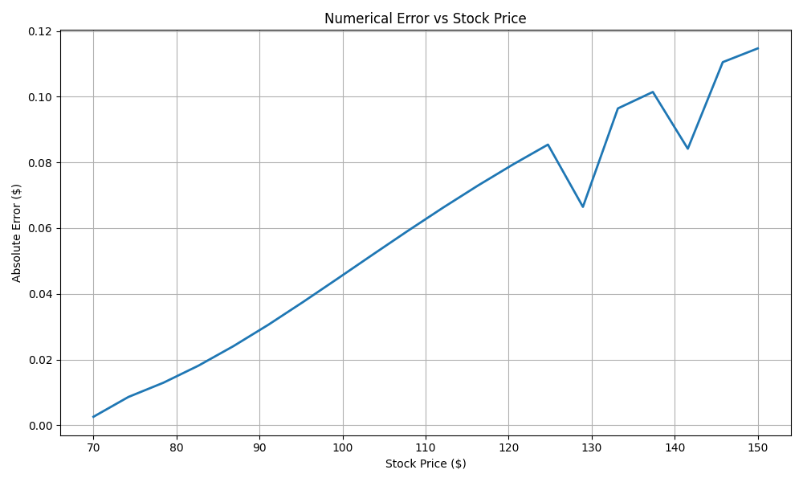

# Options Pricing with Heat Equation
## Introduction

The basis of this project is to provide accurate prices for call and put options using numerical methods. 

We start with the knowledge that the Black-Scholes equation and the heat equation are mathematically equivalent partial differential equations. 

The Black-Scholes equation is transformed into the heat equation through a change of variables and is then solved using the finite difference method. This solution is transformed back to obtain option prices. 

Results are then compared with the closed form solution.

## Results

When using the following parameters:
Stock Price:    $105.0
Strike Price:   $110.0
Time to Expiry: 0.5 year
Interest Rate:  5.0%
Volatility:     25.0%

The percentage error for call option was 0.5635%, while the percentage error for the put option was 0.2532% 

We computed a put call parity error of $0.058 

Note: The jagged portion on the error plot is a result of using a small number of sample points. Increasing the number of points would produce a smoother curve at the cost of computation time.

## Assumptions

Original Black-Scholes assumptions:
- Constant volatility
- Constant risk free interest rate
- Continuous trading
- No transaction fees
- No dividends
- Stock prices follow log-normally distributed returns
- European options

Numerical method assumptions:
- Finite grid truncated at ±3σ√T from the current log stock price
- Discrete approximation of the second partial derivative of the transformed option value with respect to log stock price
- Explicit finite differences, fixed boundary conditions

## How to Run

git clone [repo url]
pip install numpy scipy matplotlib
python main.py

